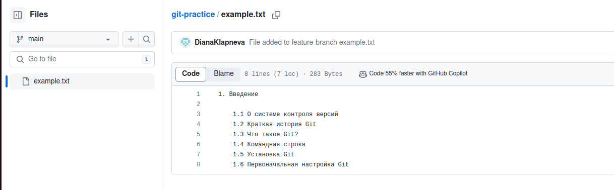

## Лабораторная работа №5
Подготовила Клапнева Диана, К3142

## Введение
Создаем новый репозиторий и загружаем в него текстовый файл со структурой книги.

В новую ветку feature-branch также загружаем файл с изменениями.

Затем сливаем ветки - теерь и на main полный текст файла.

## Работа с ветками
Создаем новый md файл со структурой книги. В новую ветку feature-login добавляем этот файл, но с изменениями.

## Работа с удаленными репозиториями

## Моделирование конфликта
Теперь создаем конфликт путем коммита изменений в файле одной из веток. В результате возникает ошибка:

## Разрешение конфликта
Конфликт разрешается путем внесения нужных изменений в файл

## Авторизация проверки формата файлов при коммите
Для этого я создаю bash-скрипт, который ищет в файлах репозитория нужные слова с помощью grep.

теперб при коммите этот код будет проверять файлы репозитория. В моих файлах есть слово git, поэтому он пишет 'correct file topic'

## Использование Git Flow в проекте
Для начала устанавливаем и инициируем git flow в нужной ветке. Затем добавляем нужный код файла task-management.py и коммитим его. После этого сливаем ветку с main, в результате чего изменения отражаются и на ней.

